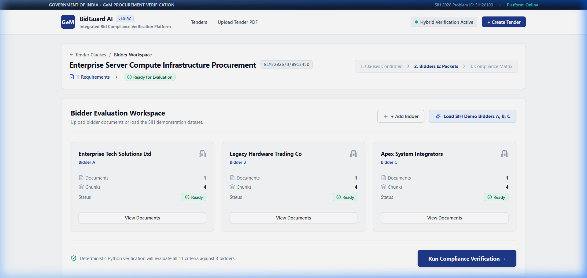
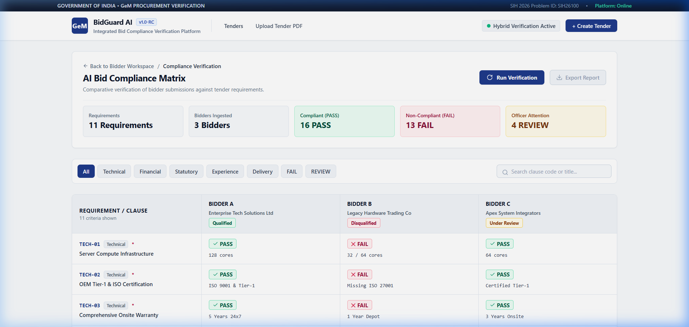
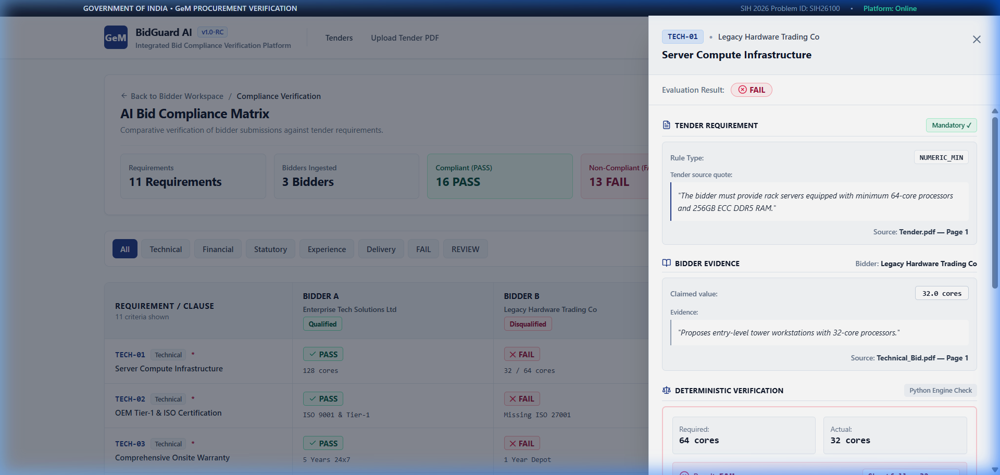
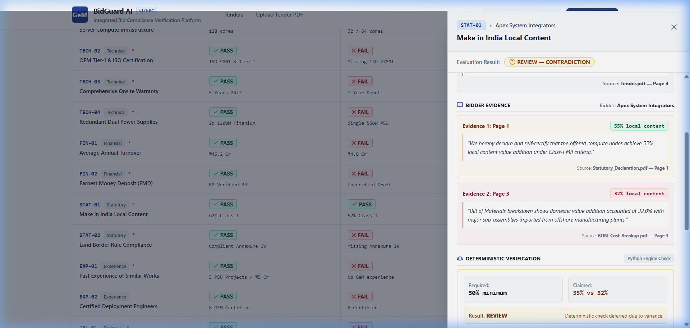
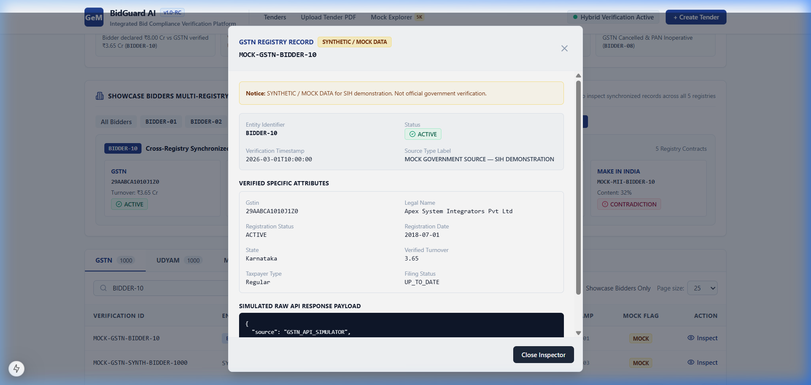
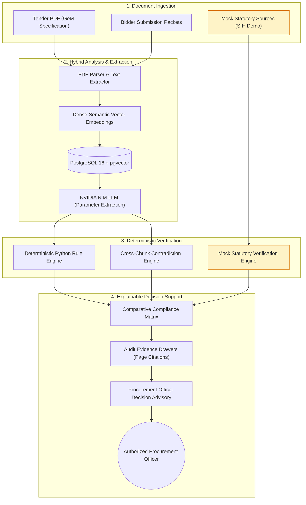

# 🛡️ BidGuard
## AI-Powered Integrated Bid Compliance Verification Platform for GeM Procurement

[](https://www.sih.gov.in/)
[](https://fastapi.tiangolo.com)
[](https://nextjs.org/)
[](https://www.postgresql.org/)
[](https://build.nvidia.com)
[]()
[](LICENSE)

> **BidGuard** transforms public procurement compliance verification from a manual, error-prone document check into an explainable, evidence-backed decision-support workflow. Built for Government e-Marketplace (GeM) tenders, it unifies **NVIDIA NIM LLM semantic interpretation** with **deterministic Python rule verification** and **cross-source mock statutory validation** to detect non-compliance, flag hidden contradictions, and uphold public procurement integrity.

---

## 📑 Table of Contents

- [The Problem](#-the-problem)
- [The Solution](#-the-solution)
- [Product Preview](#-product-preview)
- [How It Works](#-how-it-works)
- [AI Interprets. Python Verifies. Officer Decides.](#-ai-interprets-python-verifies-officer-decides)
- [Integrated Statutory Verification (SIH Demonstration)](#-integrated-statutory-verification-sih-demonstration)
- [Comparative Compliance Decision Model](#-comparative-compliance-decision-model)
- [Technology Architecture](#-technology-architecture)
- [Validation & Test Results](#-validation--test-results)
- [Production Deployment](#-production-deployment)
- [Quickstart (Local Development)](#-quickstart-local-development)
- [Project Directory Structure](#-project-directory-structure)
- [Honesty & Ethical AI Boundaries](#-honesty--ethical-ai-boundaries)
- [Team & Acknowledgments](#-team--acknowledgments)

---

## 🎯 The Problem

Public procurement on the Government e-Marketplace (GeM) involves thousands of high-value tenders across central ministries, state departments, and public sector undertakings (PSUs). Each tender mandates strict technical, financial, statutory, and delivery requirements:

1. **Massive Evaluation Bottlenecks**: Procurement officers must manually scrutinize multi-hundred-page technical brochures, audited balance sheets, ISO certifications, and statutory declarations across dozens of competing bidders.
2. **Hidden Inconsistencies & Fabrication**: Unscrupulous bidders may declare inflated annual turnover, claim fraudulent MSE tender-fee exemptions, self-certify false Make in India (MII) local content percentages, or submit contradictory numbers across different annexures.
3. **LLM Hallucination Risk in High-Stakes Decisions**: Generic generative AI models cannot be trusted with government procurement decisions because they hallucinate values, drop edge cases, and lack deterministic audit trails.
4. **Lack of Cross-Source Ground Truth**: Bidder self-declarations are often accepted without independent cross-verification against statutory authorities (GSTN, Udyam, MCA, Income Tax).

---

## 💡 The Solution

**BidGuard** provides an end-to-end, hallucination-resistant compliance verification platform tailored specifically for GeM workflows:

- **Strict Separation of Concerns**: AI does not grade or pass/fail bidders. An NVIDIA NIM LLM semantically locates and standardizes claims from unstructured PDFs, while an isolated, deterministic Python rules engine executes numeric comparisons, threshold validations, and document presence checks.
- **Cross-Chunk Contradiction Engine**: Automatically detects variance when a bidder makes divergent claims across different documents (e.g., claiming 55% local content on Page 1 but revealing only 32% domestic value addition on Page 3).
- **Integrated Statutory Verification (SIH Demonstration)**: Cross-references bidder claims against a deterministic synthetic dataset of 5,000 mock government registry records (GSTN, Udyam, MCA, Income Tax, and MII).
- **Auditable Evidence Drawers**: Every decision provides a verifiable chain of custody—linking the tender requirement, the bidder's exact textual quote, the document page number, and the mathematical formula used.
- **Procurement Officer Autonomy**: Disqualification is never automated. The system flags discrepancies and routes edge cases to `REVIEW`, empowering authorized officers with explainable recommendations.

---

## 🖥️ Product Preview

### 1. Bidder Evaluation Workspace
Procurement officers manage tenders, inspect structured clause requirements, upload bidder PDF submission packets, or load the deterministic SIH demonstration bidder cohort (`Bidder A`, `Bidder B`, `Bidder C`).


*Figure 1: Bidder Workspace showing the ingested tender requirements, attached bidder packets, and one-click hybrid compliance verification execution.*

---

### 2. Comparative Compliance Matrix
A unified multi-bidder, multi-clause comparative matrix displaying evaluation verdicts across Technical, Financial, Statutory, Experience, and Delivery clauses. Officers can immediately view qualification status (`Qualified`, `Disqualified`, `Under Review`) and filter by status or clause domain.


*Figure 2: Real-time Compliance Matrix comparing Bidder A (Compliant Enterprise), Bidder B (Non-Compliant Bidder), and Bidder C (Contradictory Submissions).*

---

### 3. Evidence-Backed Failure Analysis
Clicking any `FAIL` cell opens a slide-over Evidence Drawer detailing the exact cause of non-compliance. The drawer juxtaposes the tender requirement against the bidder's cited text, page number, and the deterministic Python rule deficit.


*Figure 3: Evidence Drawer for Clause TECH-01 (Server Compute Infrastructure). The deterministic Python check proves a 32-core deficit against the 64-core minimum requirement.*

---

### 4. Cross-Evidence Contradiction Detection
When a bidder submits divergent claims across separate pages or exhibits internal document inconsistency, BidGuard deters false qualification by assigning an unambiguous `REVIEW — CONTRADICTION` verdict.


*Figure 4: Contradiction Drawer for Clause STAT-01 (Make in India). Highlights 55% local content claimed on Page 1 contradicted by 32% domestic content declared in the Page 3 BOM.*

---

### 5. Mock Integrated Verification Data Explorer
A dedicated inspection interface enabling procurement administrators and evaluators to browse, search, and verify the 5,000 deterministic mock government registry records utilized during the SIH demonstration.


*Figure 5: Mock Data Explorer displaying synchronized multi-registry attributes for showcase bidder `BIDDER-10` across GSTN, Udyam, MCA, Income Tax, and MII.*

---

## 🧠 AI Interprets. Python Verifies. Officer Decides.

BidGuard is engineered around a core safety architecture that mitigates generative hallucination in government procurement evaluation:

```
┌─────────────────────────────────────────────────────────────────────────────┐
│                             BIDGUARD SAFETY TRIAD                           │
├───────────────────────────────┬─────────────────────────────────────────────┤
│ 1. AI Interprets              │ NVIDIA NIM LLM extracts parameters from     │
│    (Unstructured → Structured)│ unstructured PDFs into typed Pydantic data. │
├───────────────────────────────┼─────────────────────────────────────────────┤
│ 2. Python Verifies            │ Deterministic rules validate thresholds,    │
│    (Deterministic & Verifiable│ numeric floors, and document presence.      │
├───────────────────────────────┼─────────────────────────────────────────────┤
│ 3. Officer Decides            │ Ambiguities and contradictions route to     │
│    (Human-in-the-Loop)        │ REVIEW. Officer retains final authority.    │
└───────────────────────────────┴─────────────────────────────────────────────┘
```

- **Deterministic Rule Thresholding**: AI never decides if `32 >= 64`. Deterministic Python rules evaluate all mathematical conditions (`actual >= required`), ensuring 100% reproducible and verifiable decisions.
- **Strict Evidence Citation**: Every extracted claim must reference a verified text snippet and page number from the uploaded PDF. Uncited extractions are rejected.
- **Deterministic Contradiction Flagging**: If multiple chunks from a single bidder present conflicting numeric values, the evaluation is automatically deferred to human review rather than guessing an average or picking the highest value.
- **No Autonomous Disqualification**: The platform operates as an explainable decision-support copilot. It generates advisory recommendations for evaluation. Final qualification remains with the authorized procurement officer.

---

## 🔄 How It Works



---

## 🏛️ Integrated Statutory Verification (SIH Demonstration)

In GeM procurement, bidder self-declarations cannot be validated in isolation. BidGuard demonstrates **Multi-Source Cross-Verification** using an integration-ready architecture backed by **5,000 deterministic synthetic records** (1,000 records across each of 5 synthetic mock government-source interfaces for the SIH demonstration):

| Source Registry | Code | Primary Identifier | Verified Attributes | Synthetic Records | SIH Demonstration Role |
| :--- | :--- | :--- | :--- | :---: | :--- |
| **Goods & Services Tax Network** | `GSTN` | GSTIN (15 chars) | Annual verified turnover, registration status, filing regularity | 1,000 | Verifies declared annual turnover against actual tax filings |
| **Udyam / MSME Portal** | `UDYAM` | Udyam Reg. Number | Enterprise tier (Micro/Small/Medium), statutory exemption eligibility | 1,000 | Confirms legitimate MSE status for tender fee & EMD waivers |
| **Ministry of Corporate Affairs** | `MCA` | CIN (21 chars) | Corporate legal name, ROC state, status (ACTIVE / STRUCK OFF) | 1,000 | Validates corporate standing and detects shell entities |
| **Income Tax Department** | `INCOME_TAX` | PAN (10 chars) | Legal identity match, PAN status (ACTIVE / INOPERATIVE), ITR filing | 1,000 | Cross-checks entity PAN validity and operational status |
| **Make in India (MII) Registry** | `MII` | Audit Verification ID | Verified domestic content %, Class-I/II certification, auditor ref | 1,000 | Detects false domestic value-addition self-certifications |
| **TOTAL SYNTHETIC DATASET** | | | | **5,000** | **100% Mock Labeled (`is_mock=True`)** |

> **IMPORTANT DISCLAIMER — SIH 2026 DEMONSTRATION ONLY**:
> BidGuard does **NOT** access live government databases or private APIs. All external verification data consists strictly of deterministic, synthetic mock datasets generated for the Smart India Hackathon under seed `26100`. Every mock record carries `is_mock = True` and source type `MOCK GOVERNMENT SOURCE — SIH DEMONSTRATION`.

---

## ⚖️ Comparative Compliance Decision Model

The hybrid engine categorizes every evaluated tender requirement into three rigorous states:

| Verdict | Meaning | System Behavior |
| :---: | :--- | :--- |
| <span style="color:#16a34a; font-weight:bold;">PASS</span> | **Fully Compliant** | The bidder's extracted evidence satisfies or exceeds the minimum numerical threshold, ceiling, or mandatory certificate requirement with verifiable page citations. |
| <span style="color:#dc2626; font-weight:bold;">FAIL</span> | **Non-Compliant** | The extracted evidence definitively breaches tender criteria (e.g., shortfall in CPU cores, expired warranty, inadequate turnover, missing mandatory ISO certification). |
| <span style="color:#d97706; font-weight:bold;">REVIEW</span> | **Ambiguous / Contradictory** | Triggered when: (1) evidence across different proposal pages contradicts itself, (2) extracted text is ambiguous, or (3) document presence is qualitative and requires procurement officer scrutiny. |

### Deterministic Demonstration Cohort
The platform includes 3 canonical demonstration bidder submissions evaluated against 11 mandatory tender clauses:

- **Bidder A (Enterprise Tech Solutions Ltd)**: Fully compliant enterprise meeting all 11 requirements (11 PASS, 0 FAIL, 0 REVIEW) → **Qualified**.
- **Bidder B (Legacy Hardware Trading Co)**: Submits under-spec hardware, missing certifications, inadequate turnover, and extended delivery timelines (1 PASS, 9 FAIL, 1 REVIEW) → **Disqualified**.
- **Bidder C (Apex System Integrators)**: Presents contradictory turnover and Make in India self-declarations across pages (3 PASS, 5 FAIL, 3 REVIEW) → **Under Review**.

---

## 🏗️ Technology Architecture

```
Internet / Procurement Officers
       │
       ▼ [Port 80 / 443]
┌─────────────────────────────────────────────────────────────┐
│ Reverse Proxy (Caddy / HTTPS with Automatic TLS)            │
│  - Single-Domain Routing: /api/* → Backend, /* → Frontend   │
│  - Request Size Limit: 60MB (Tender & Bidder PDF Packets)   │
└──────────────┬───────────────────────────────┬──────────────┘
               │                               │
      [Port 3000 / Internal]          [Port 8000 / Internal]
               ▼                               ▼
┌───────────────────────────────┐ ┌───────────────────────────┐
│ Next.js 14 Frontend           │ │ FastAPI Backend (Python)  │
│  - React 19 + Tailwind CSS    │ │  - Async SQLAlchemy 2.0   │
│  - Responsive Matrix UI       │ │  - PyMuPDF Parser         │
│  - Interactive Audit Drawers  │ │  - Rule & Contradiction   │
│  - Mock Data Explorer         │ │    Engines                │
└───────────────────────────────┘ └─────────────┬─────────────┘
                                                │
                          ┌─────────────────────┴─────────────────────┐
                          │                                           │
                 [Internal / Isolated]                       [Secure HTTPS Call]
                          ▼                                           ▼
┌───────────────────────────────────────────────────┐ ┌───────────────────────────┐
│ PostgreSQL 16 + pgvector                          │ │ NVIDIA NIM Cloud API      │
│  - Persistent Volume: postgres_data               │ │  - openai/gpt-oss-20b     │
│  - Canonical Source of Truth (5,000 Mock Records) │ │  - Zero Key Leakage Guard │
│  - Port 5432 Never Publicly Exposed               │ │  - Server-Side Only       │
└───────────────────────────────────────────────────┘ └───────────────────────────┘
```

- **Frontend**: Next.js 14 (App Router), React 19, TypeScript, Tailwind CSS, Lucide Icons.
- **Backend**: FastAPI, Python 3.12+, Async SQLAlchemy 2.0, Pydantic v2.
- **Database**: PostgreSQL 16 with `pgvector` and `uuid-ossp` extensions.
- **Reverse Proxy**: Caddy with automatic HTTPS, HTTP/2, and unified single-domain routing.
- **AI Inference**: NVIDIA NIM API (`openai/gpt-oss-20b`) called strictly from backend workers.

---

## 🧪 Validation & Test Results

BidGuard's compliance, extraction, retrieval, database, and mock data components are verified through an extensive automated test suite:

> **108 automated tests passed + 11/11 integration criteria passed.**

```
============================== TEST SUITE EXECUTION ==============================
Suite                                    Tests     Status      Runtime
---------------------------------------------------------------------------------
Canonical Baseline (Unit + API)          52 / 52   PASSED      7.12s
Phase 6 Mock Source Engine               19 / 19   PASSED      2.26s
Mock Verification Data Explorer          19 / 19   PASSED      4.79s
Database Hardening & Fail-Fast Guard      7 / 7    PASSED      6.84s
End-to-End Compliance Integration        11 / 11   PASSED      11.40s
Frontend Standalone Production Build      0 errors PASSED      12.80s
---------------------------------------------------------------------------------
TOTAL AUTOMATED TEST COVERAGE           108 / 108  PASSED (100%)
=================================================================================
```

- **52/52 Canonical Baseline Tests**: Clause extraction, bidder retrieval with strict tenant isolation, compliance rule evaluation, and REST API endpoints.
- **19/19 Phase 6 Mock Tests**: Schema contracts, synthetic dataset integrity, index coverage, and idempotent seeding across all 5 source registries.
- **19/19 Mock Explorer Tests**: Registry filtering, search queries, showcase bidder synchronization, CSV export, and read-only data guard.
- **7/7 Database Hardening Tests**: Explicit `ALLOW_SQLITE_FALLBACK=False` fail-fast validation, pool disposal across loops, and health diagnostics.
- **11/11 Compliance Integration Criteria**: Verified deterministic behavior across all 11 clauses for Bidder A, Bidder B, and Bidder C.
- **Zero Secrets Tracked**: Full repository scanned via `git diff --check` with zero API keys or production credentials tracked.

---

## 🚀 Production Deployment

BidGuard provides a hardened multi-container production configuration using Docker Compose and Caddy.

### Production Highlights
- **Single-Domain HTTPS Architecture**: Eliminates CORS complications by routing `https://<domain>/api/*` to the backend and `https://<domain>/*` to the frontend.
- **Isolated Database Network**: PostgreSQL port 5432 is strictly internal to the Docker network and **never exposed to the public internet**.
- **Fail-Fast Database Integrity**: Configured with `ALLOW_SQLITE_FALLBACK=false` to prevent silent fallback or data divergence.
- **Zero API Key Leakage**: `NVIDIA_API_KEY` exists exclusively in the backend container environment. It is never exposed to the frontend or browser.
- **Deterministic Startup**: Healthchecks ensure PostgreSQL is fully healthy before backend migrations and idempotent mock seeders initialize.

### Deploying with Docker Compose

1. **Configure Environment Variables**:
   ```bash
   cp .env.production.example .env.production
   ```
   Populate `.env.production` with secure credentials and your domain:
   ```env
   DOMAIN=bidguard.example.com
   POSTGRES_USER=bidguard_admin
   POSTGRES_PASSWORD=your_secure_random_production_password
   POSTGRES_DB=gem_compliance_prod
   NVIDIA_API_KEY=nvapi-your-production-nvidia-key
   ALLOW_SQLITE_FALLBACK=false
   ```

2. **Launch the Production Stack**:
   ```bash
   docker compose -f docker/docker-compose.prod.yml --env-file .env.production up -d --build
   ```

3. **Verify Deployment Health**:
   ```bash
   curl -s https://bidguard.example.com/api/v1/health | jq .
   ```
   *Expected Response:*
   ```json
   {
     "status": "healthy",
     "database": "postgresql",
     "database_status": "HEALTHY",
     "version": "1.0.0"
   }
   ```

*For backup procedures with `pg_dump`, disaster recovery, and operational runbooks, refer to [DEPLOYMENT.md](docs/DEPLOYMENT.md).*

---

## 💻 Quickstart (Local Development)

### Prerequisites
- Python 3.12+
- Node.js 20+
- PostgreSQL 16 with `pgvector` (or Docker)
- NVIDIA NIM API Key ([build.nvidia.com](https://build.nvidia.com))

### 1. Clone Repository & Setup Backend
```bash
git clone https://github.com/harshilsetty/sih26100-bidguard.git
cd sih26100-bidguard/backend

python -m venv .venv
# On Windows:
.venv\Scripts\activate
# On Linux/macOS:
# source .venv/bin/activate

pip install -r requirements.txt
cp ../.env.example ../.env
```

### 2. Seed Database & Start Backend Server
```bash
python -m app.services.mock_seeder
uvicorn app.main:app --reload --port 8000
```

### 3. Setup & Start Next.js Frontend
```bash
cd ../frontend
npm install
npm run dev
```

Visit [http://localhost:3000](http://localhost:3000) to access the BidGuard UI.

---

## 📁 Project Directory Structure

```
sih26100-bidguard/
├── docker/
│   ├── docker-compose.yml           # Local development Docker Compose
│   ├── docker-compose.prod.yml      # Hardened production Docker Compose
│   ├── Dockerfile.backend           # Production FastAPI container
│   ├── Dockerfile.frontend          # Production Next.js standalone container
│   ├── Caddyfile                    # Production reverse proxy with auto HTTPS
│   └── entrypoint.backend.sh        # Deterministic pre-flight seeder & entrypoint
├── backend/
│   ├── app/
│   │   ├── api/v1/                  # REST API (health, tenders, bidders, mock-sources)
│   │   ├── core/                    # Database, config, fail-fast guards, pgvector
│   │   ├── models/                  # SQLAlchemy ORM models
│   │   ├── schemas/                 # Pydantic validation contracts
│   │   └── services/                # NIM client, Rule engine, Contradiction engine
│   ├── mock_data/                   # 5,000 deterministic synthetic records (JSON fixtures)
│   └── requirements.txt
├── frontend/
│   ├── src/
│   │   ├── app/                     # App router (Workspace, Matrix, Mock Explorer)
│   │   ├── components/              # UI components (Matrix, Evidence Drawers)
│   │   └── lib/                     # API client & shared TypeScript types
│   ├── package.json
│   └── tsconfig.json
├── docs/
│   ├── DEPLOYMENT.md                # Production runbook, security review & backups
│   ├── PHASE_6_INTEGRATED_VERIFICATION.md # Architecture specification
│   └── assets/screenshots/          # Application screenshots for project showcase
├── .env.example                     # Local development environment template
├── .env.production.example          # Hardened production environment template
└── README.md
```

---

## 🔒 Honesty & Ethical AI Boundaries

In compliance with the Smart India Hackathon guidelines, BidGuard adheres to strict transparency principles:

1. **No Live Government API Claims**: We do not claim live integration with GeM, GSTN, Udyam, MCA, or Income Tax systems. All external checks utilize deterministic synthetic mock records designed to demonstrate an integration-ready architecture.
2. **Deterministic Primacy**: Generative AI models are strictly restricted to parameter identification from unstructured text. Threshold comparisons, mathematical verifications, and cross-source checks are performed by auditable Python code.
3. **No Automated Disqualifications**: BidGuard serves strictly as an explainable decision-support system. Final qualification authority remains with the authorized procurement officer.
4. **Data Isolation**: Tenant and bidder isolation is strictly enforced; evidence chunks from one bidder are never accessible during the evaluation of another.

---

## 👥 Team & Acknowledgments

- **Harshil** — BTech AIML — Team Lead
- **Karthik** — Cloud
- **Kethana** — Full Stack
- **Jahnavi** — Cloud
- **Kesav** — Full Stack
- **Rohitha** — BCA, AIML — Final Year

- **Hackathon**: Smart India Hackathon (SIH 2026)
- **Problem Statement ID**: SIH26100
- **Organization**: Government e-Marketplace (GeM), Ministry of Commerce and Industry

---

*BidGuard — Transparent, Explainable, and Evidence-Backed Public Procurement Verification.*
